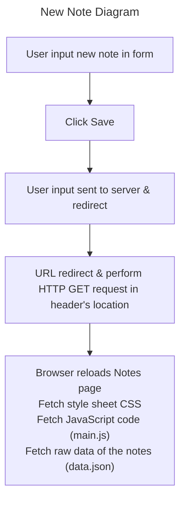

```mermaid
---
title: New Note Diagram
---
flowchart TD
  A["User input new note in form"]-->
B["Click Save"]-->
C["User input sent to server & redirect"]-->
D["URL redirect & perform HTTP GET request in header's location"]-->
E["`Browser reloads Notes page
Fetch style sheet CSS
Fetch JavaScript code (main.js)
Fetch raw data of the notes (data.json)`"]


```
